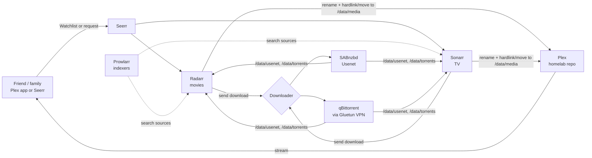

# plex-server: requests + automatic downloads for the homelab

The **media automation layer** for the homelab media PC (`mediabox`). Friends and family add a movie or show to their **Plex Watchlist** (or request it in **Seerr**), and it downloads and appears in Plex automatically.

The machine itself (hardware, Ubuntu, drives, Docker, Tailscale, backups) and **Plex/Jellyfin** are owned by the homelab repo, **[chris-suryo/pi-hole-ad-blocker](https://github.com/chris-suryo/pi-hole-ad-blocker)**. This repo only fills the media folder those servers read. The split and the shared conventions are in [docs/01-prerequisites.md](docs/01-prerequisites.md).

## How it works



Supporting apps:

- **Recyclarr** applies TRaSH Guides quality profiles, so the stack grabs good releases and skips junk.
- **Bazarr** fetches subtitles.
- **Unpackerr** extracts archived torrents.
- **Tautulli** tracks Plex stats.

## Decisions

| Area | Decision |
|---|---|
| Scope | This repo = automation only. Platform + Plex = homelab repo. |
| Requests | Seerr with **auto-approve**; Plex Watchlist auto-request |
| Quality | 1080p (TRaSH *WEB-1080p* / *HD Bluray + WEB*): direct-plays almost everywhere, cheap to transcode for remote friends |
| **Open** | Download source: Usenet and/or torrents + VPN. Both are built in; switch on with `COMPOSE_PROFILES`. |
| **Open** (homelab) | Plex Pass for remote friends ($69.99/yr); router CGNAT check; drive layout (ZFS mirror) |

Background research, with sources: [docs/research.md](docs/research.md).

## Setup, in order

0. **homelab repo** Phases 1, 6 and 7 §4: router, media PC, data drive, Docker, Tailscale, Plex
1. [Prerequisites + bootstrap](docs/01-prerequisites.md): the shared conventions, then `scripts/bootstrap.sh`
2. [Start and connect the apps](docs/02-configure-apps.md): downloader, Sonarr/Radarr, Prowlarr, Recyclarr, Seerr, end-to-end test
3. [Friends and remote admin](docs/03-friends-access.md): Watchlist requests, Seerr via Cloudflare Tunnel, phone apps

## Apps and ports (on `mediabox`)

| App | Port | Profile |
|---|---|---|
| Seerr | 5055 | core |
| Sonarr | 8989 | core |
| Radarr | 7878 | core |
| Prowlarr | 9696 | core |
| Bazarr | 6767 | core |
| Tautulli | 8181 | core |
| Recyclarr | none (runs daily) | core |
| SABnzbd | 8085 | `usenet` |
| Gluetun + qBittorrent | 8080 | `torrent` |
| Unpackerr | none | `torrent` |
| Cloudflared | none (outbound tunnel) | `public` |

Nothing here is port-forwarded. Plex's 32400 (homelab) is the only open port.

## Day-to-day

```bash
cd ~/plex-server
docker compose ps                  # status
docker compose logs -f radarr      # logs for one app
./scripts/update.sh                # pull repo changes + newest images, restart what changed
```

**Updates**: run `./scripts/update.sh` every week or two. It isn't automatic on purpose, so a bad release doesn't break things overnight.

**Backups** are handled by the homelab repo. App data lives in `/srv/appdata/<app>`, which homelab backs up. Keep `~/plex-server/.env` in that backup too (VPN and API keys). `/srv/storage/data/{torrents,usenet}` doesn't need backing up.

## Repo layout

```
compose.yaml              all services; optional groups via profiles
.env.example              settings template → copy to .env (git-ignored)
recyclarr/recyclarr.yml   TRaSH quality profiles for Sonarr/Radarr
scripts/bootstrap.sh      folders, permissions, hardlink check, compose validation
scripts/update.sh         update repo + images
docs/                     step-by-step guides + research
```

## Tested

- `compose.yaml` validates with every profile combination. The Gluetun port-forward commands match the Gluetun wiki exactly.
- `scripts/*.sh` pass `shellcheck`. `bootstrap.sh` was run twice on a fresh Ubuntu 24.04 container and is idempotent. It also warns correctly when:
  - `/srv/storage` isn't a separate drive
  - hardlinks can't cross from `torrents/` to `media/`
- Sonarr and Radarr were started from this `compose.yaml`, and `recyclarr sync` created both quality profiles (77 custom formats).
- Sonarr accepted `/data/media/tv` as a root folder, and a hardlink across `/data/torrents` → `/data/media` works.
- Not yet tested on the real hardware: a VPN connection and a real download.

> The tools here are neutral automation software. What you download, and from where, is your responsibility. Copyright law applies.
