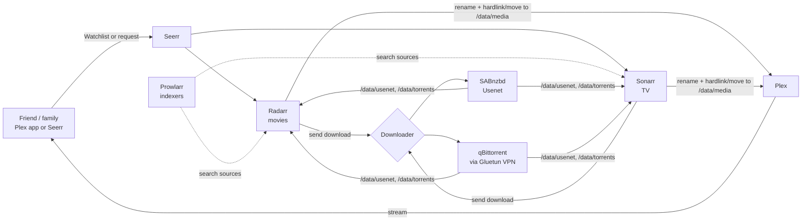

# Home Plex server with automatic downloads

A self-hosted Plex server on a repurposed PC. Friends and family add a movie or show to their **Plex Watchlist** (or request it in **Seerr**), and it downloads and appears in Plex automatically.

Everything runs in Docker on Ubuntu Server and is defined in this repo.

## How it works



Supporting apps:

- **Recyclarr** applies TRaSH Guides quality profiles, so the stack grabs good releases and skips junk.
- **Bazarr** fetches subtitles.
- **Unpackerr** extracts archived torrents.
- **Tautulli** tracks Plex stats.

## Decisions so far

| Area | Decision |
|---|---|
| Hardware | Old PC: i7-8700K. Transcoding uses the **UHD 630 iGPU** (Quick Sync). GTX 1070 Ti removed (not needed). 16 GB RAM, wired gigabit. |
| Storage | New SSD (OS + app data) + one 12–20 TB CMR HDD at `/data`. Room to add drives later (mergerfs + SnapRAID). |
| OS | Ubuntu Server LTS + Docker Compose |
| Media server | Plex |
| Requests | Seerr with **auto-approve**; Plex Watchlist auto-request |
| Viewers | Household plus friends and family remotely |
| **Open** | Plex Pass: needed for remote friends and hardware transcoding ($69.99/yr or $249.99 for 5 yrs) |
| **Open** | Download source: Usenet and/or torrents + VPN. Both are built in; switch on with `COMPOSE_PROFILES`. |
| **Open** | Router access and CGNAT check for Plex remote access |

Background research, with sources: [docs/research.md](docs/research.md).

## Setup, in order

1. [Hardware and BIOS](docs/01-hardware.md): buy drives, pull the GPU, BIOS settings
2. [Install Ubuntu Server](docs/02-install-ubuntu.md): OS on the SSD, SSH, fixed IP, clone this repo
3. [Media drive + bootstrap](docs/03-storage.md): format and mount the HDD at `/data`, run `scripts/bootstrap.sh`
4. [Start and connect the apps](docs/04-configure-apps.md): Plex, downloader, Sonarr/Radarr, Prowlarr, Recyclarr, Seerr, end-to-end test
5. [Remote access](docs/05-remote-access.md): Plex for friends, Seerr via Cloudflare Tunnel, Tailscale for admin

## Apps and ports

| App | Port | Profile |
|---|---|---|
| Plex | 32400 (host network) | core |
| Seerr | 5055 | core |
| Sonarr | 8989 | core |
| Radarr | 7878 | core |
| Prowlarr | 9696 | core |
| Bazarr | 6767 | core |
| Tautulli | 8181 | core |
| Recyclarr | none (runs daily) | core |
| SABnzbd | 8085 | `usenet` |
| Gluetun + qBittorrent | 8080 | `torrent` |
| Unpackerr | none | `torrent` |
| Cloudflared | none (outbound tunnel) | `public` |

Only **32400** should ever be port-forwarded. Everything else stays on the LAN or Tailscale.

## Day-to-day

```bash
cd ~/plex-server
docker compose ps                  # status
docker compose logs -f radarr      # logs for one app
./scripts/update.sh                # pull repo changes + newest images, restart what changed
sudo ./scripts/backup.sh           # back up app settings/databases to /data/backups
```

**Updates**: run `./scripts/update.sh` every week or two. It isn't automatic on purpose, so a bad release doesn't break things overnight. Check the release notes if something looks off.

**Backups**: schedule weekly (the stack stops for a minute or two):

```bash
sudo crontab -e
# add:
0 4 * * 1 /home/<you>/plex-server/scripts/backup.sh >> /var/log/media-backup.log 2>&1
```

Backups include each app's settings and databases plus `.env` (which holds secrets, so the archives are root-only). They don't include media. Copy them off the server now and then (USB drive or cloud); a backup on the same disk won't survive that disk dying.

## Repo layout

```
compose.yaml              all services; optional groups via profiles
.env.example              settings template → copy to .env (git-ignored)
recyclarr/recyclarr.yml   TRaSH quality profiles for Sonarr/Radarr
scripts/bootstrap.sh      one-time host setup (Docker, folders, permissions)
scripts/update.sh         update repo + images
scripts/backup.sh         back up app data
docs/                     step-by-step guides + research
```

## Tested

- `compose.yaml` validates with every profile combination. The Gluetun port-forward commands match the Gluetun wiki exactly.
- `scripts/*.sh` pass `shellcheck`. `bootstrap.sh` was run twice on a fresh Ubuntu 24.04 container and is idempotent.
- Sonarr and Radarr were started from this `compose.yaml`, and `recyclarr sync` created both quality profiles (77 custom formats).
- Sonarr accepted `/data/media/tv` as a root folder, and a hardlink across `/data/torrents` → `/data/media` works.
- `backup.sh`: the archive includes settings and `.env`, skips Plex cache and logs, and rotation keeps the newest `KEEP` archives.
- Not yet tested on the real hardware: Plex with Quick Sync, a VPN connection, and a real download.

> The tools here are neutral automation software. What you download, and from where, is your responsibility. Copyright law applies.
